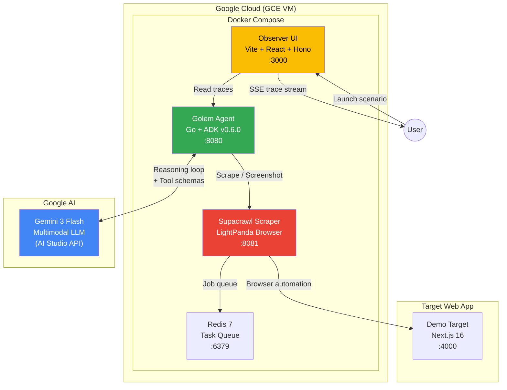
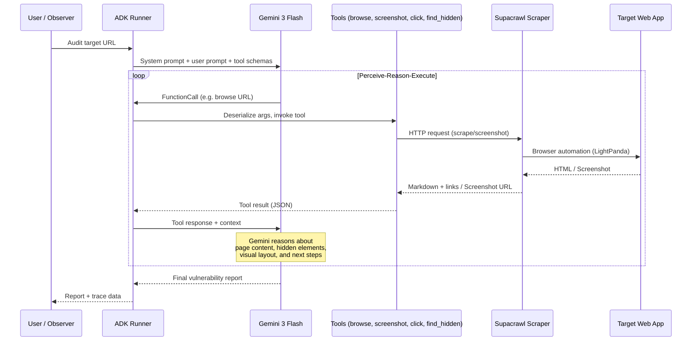
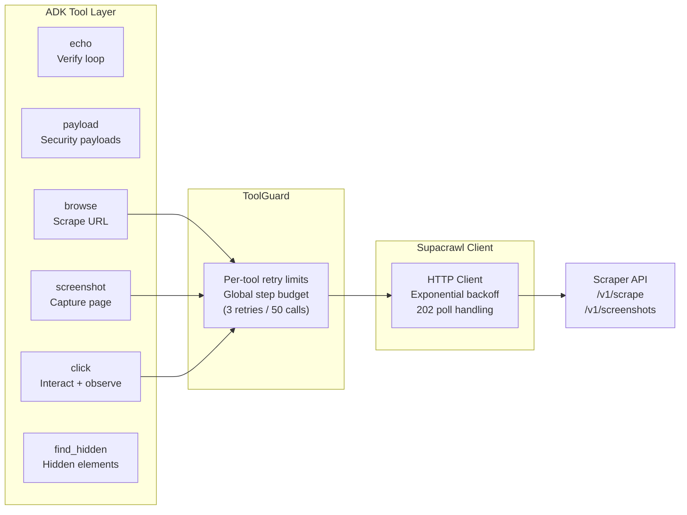
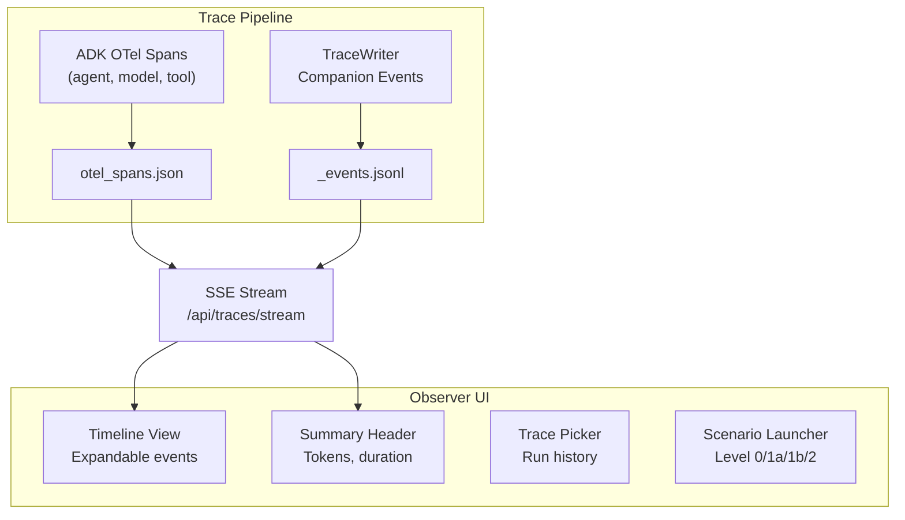

# Architecture

## System Overview

```mermaid
graph TB
    subgraph "Google Cloud (GCE VM)"
        subgraph "Docker Compose"
            Observer["Observer UI<br/>Vite + React + Hono<br/>:3000"]
            Golem["Golem Agent<br/>Go + ADK v0.6.0<br/>:8080"]
            Scraper["Supacrawl Scraper<br/>LightPanda Browser<br/>:8081"]
            Redis["Redis 7<br/>Task Queue<br/>:6379"]
        end
    end

    subgraph "Google AI"
        Gemini["Gemini 3 Flash<br/>Multimodal LLM<br/>(AI Studio API)"]
    end

    subgraph "Target Web App"
        Target["Demo Target<br/>Next.js 16<br/>:4000"]
    end

    User((User)) -->|"Launch scenario"| Observer
    Observer -->|"SSE trace stream"| User
    Observer -->|"Read traces"| Golem

    Golem <-->|"Reasoning loop<br/>+ Tool schemas"| Gemini
    Golem -->|"Scrape / Screenshot"| Scraper
    Scraper -->|"Browser automation"| Target
    Scraper -->|"Job queue"| Redis

    style Gemini fill:#4285F4,color:#fff
    style Golem fill:#34A853,color:#fff
    style Observer fill:#FBBC04,color:#000
    style Scraper fill:#EA4335,color:#fff
```

## Agent Reasoning Loop

```mermaid
sequenceDiagram
    participant U as User / Observer
    participant R as ADK Runner
    participant G as Gemini 3 Flash
    participant T as Tools (browse, screenshot, click, find_hidden)
    participant S as Supacrawl Scraper
    participant W as Target Web App

    U->>R: Audit target URL
    R->>G: System prompt + user prompt + tool schemas

    loop Perceive-Reason-Execute
        G->>R: FunctionCall (e.g. browse URL)
        R->>T: Deserialize args, invoke tool
        T->>S: HTTP request (scrape/screenshot)
        S->>W: Browser automation (LightPanda)
        W-->>S: HTML / Screenshot
        S-->>T: Markdown + links / Screenshot URL
        T-->>R: Tool result (JSON)
        R->>G: Tool response + context

        Note over G: Gemini reasons about<br/>page content, hidden elements,<br/>visual layout, and next steps
    end

    G-->>R: Final vulnerability report
    R-->>U: Report + trace data
```

## Tool Architecture

```mermaid
graph LR
    subgraph "ADK Tool Layer"
        Echo["echo<br/>Verify loop"]
        Payload["payload<br/>Security payloads"]
        Browse["browse<br/>Scrape URL"]
        Screenshot["screenshot<br/>Capture page"]
        Click["click<br/>Interact + observe"]
        FindHidden["find_hidden<br/>Hidden elements"]
    end

    subgraph "ToolGuard"
        Guard["Per-tool retry limits<br/>Global step budget<br/>(3 retries / 50 calls)"]
    end

    subgraph "Supacrawl Client"
        HTTP["HTTP Client<br/>Exponential backoff<br/>202 poll handling"]
    end

    Browse --> Guard
    Screenshot --> Guard
    Click --> Guard
    Guard --> HTTP
    HTTP --> ScraperAPI["Scraper API<br/>/v1/scrape<br/>/v1/screenshots"]
```

## Observability

```mermaid
graph TB
    subgraph "Trace Pipeline"
        ADK["ADK OTel Spans<br/>(agent, model, tool)"]
        TW["TraceWriter<br/>Companion Events"]
        OTel["otel_spans.json"]
        Events["_events.jsonl"]
    end

    subgraph "Observer UI"
        Timeline["Timeline View<br/>Expandable events"]
        Summary["Summary Header<br/>Tokens, duration"]
        Sidebar["Trace Picker<br/>Run history"]
        Launcher["Scenario Launcher<br/>Level 0/1a/1b/2"]
    end

    ADK --> OTel
    TW --> Events
    OTel --> SSE["SSE Stream<br/>/api/traces/stream"]
    Events --> SSE
    SSE --> Timeline
    SSE --> Summary
```
